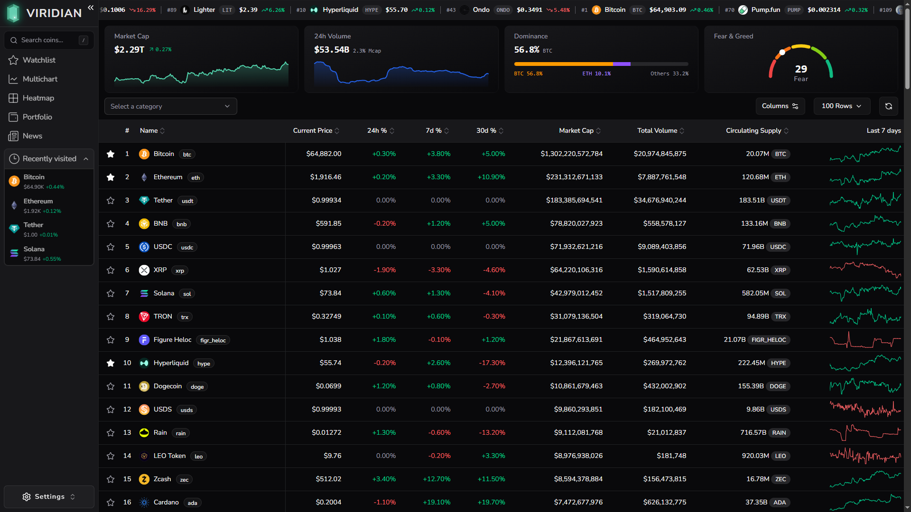
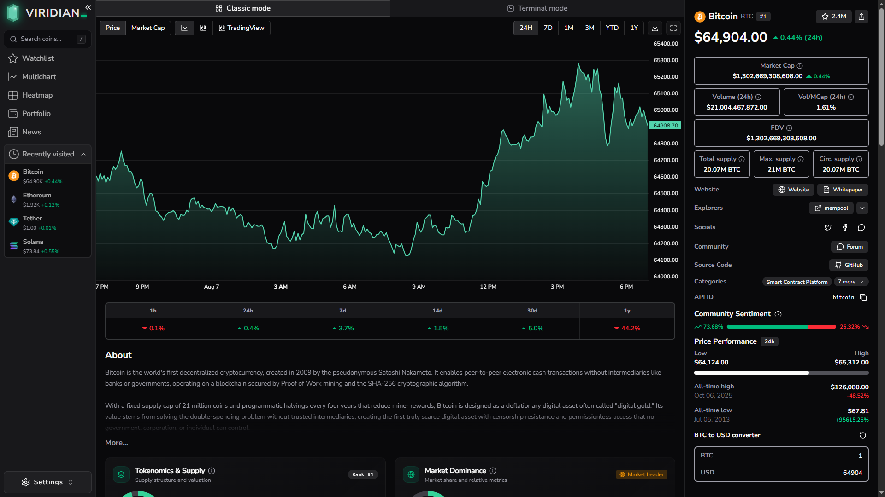
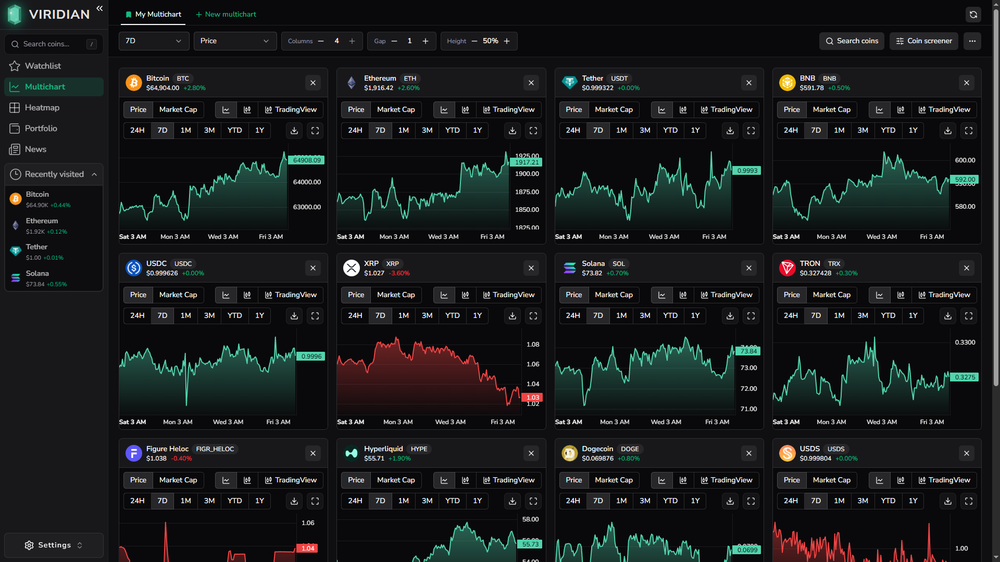
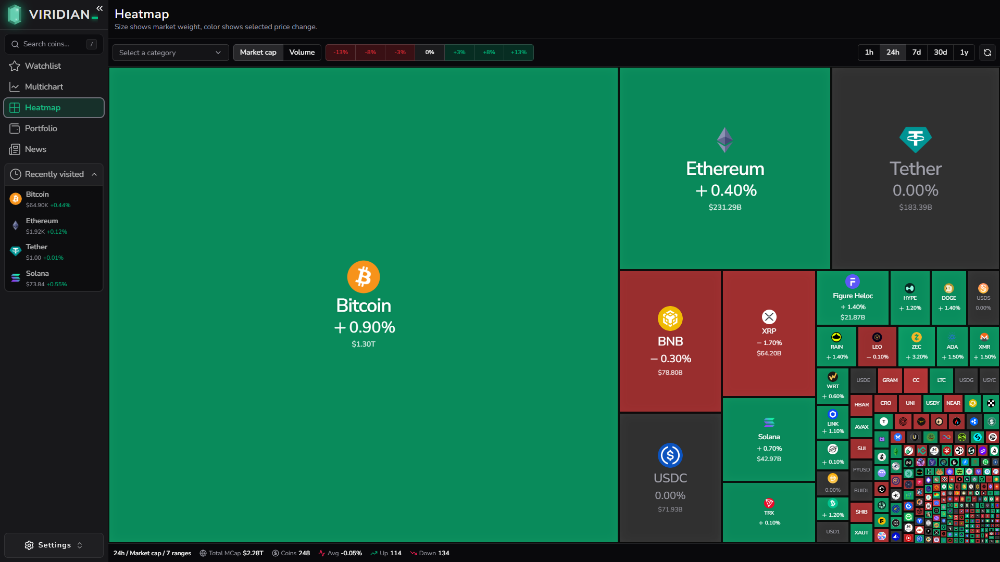

<div align="center">
  

# Viridian

**A modern workspace for exploring and monitoring the crypto market.**

[](https://react.dev/)
[](https://www.typescriptlang.org/)
[](https://vite.dev/)
[](https://github.com/1krasyuk/viridian/actions/workflows/pr-checks.yml)

</div>

Viridian brings live market data, asset research, watchlists, comparative charts,
heatmaps, and financial news into a single responsive dashboard. It is built as a
client-side React application and uses public market-data providers directly from
the browser.

> [!NOTE]
> Viridian is an educational analytics project, not financial advice. Market data
> may be delayed, incomplete, or unavailable because of third-party API limits.

## Screenshots

### Market overview



### Asset analytics



### Multichart workspace



### Market heatmap



## Features

- **Market overview** — trending assets, global metrics, sortable coin table, and
  insights across the top 250 assets.
- **Asset research** — price and volume charts, market statistics, tokenomics,
  risk metrics, ROI calculations, scenarios, tickers, and project information.
- **Watchlist** — persistent local watchlist with performance, dominance,
  sentiment, and market-cap summaries.
- **Multichart workspace** — configurable chart grids, multiple saved layouts,
  coin screening, and per-chart time ranges and data types.
- **Market heatmap** — filter by category and performance range, switch periods,
  and size tiles by market cap or volume.
- **Market briefing** — topic-based financial news with watchlist context.
- **Global search** — debounced coin search, trending assets, recent searches,
  and keyboard access.
- **Personalized UI** — currency selection, light and dark themes, responsive
  navigation, and preferences saved in the browser.

## Tech stack

| Area             | Technology                                 |
| ---------------- | ------------------------------------------ |
| UI               | React 19, TypeScript, Tailwind CSS 4       |
| Components       | Base UI, Radix UI, shadcn/ui, Lucide Icons |
| Routing          | TanStack Router                            |
| Server state     | TanStack Query, Axios                      |
| Client state     | Zustand                                    |
| Tables and forms | TanStack Table, React Hook Form, Zod       |
| Charts           | Lightweight Charts, TradingView embeds     |
| Tooling          | Vite, ESLint, TypeScript                   |
| Deploy           | GitHub Actions, Cloudflare Pages           |

## Getting started

### Prerequisites

- [Node.js](https://nodejs.org/) 20 or newer
- npm (included with Node.js)
- A [CoinGecko Demo API key](https://www.coingecko.com/en/developers/dashboard)
- A [Financial Modeling Prep API key](https://site.financialmodelingprep.com/developer/docs/)
  for the news feed

### Installation

```bash
git clone https://github.com/1krasyuk/viridian.git
cd viridian
npm ci
```

Copy the example environment file and add your API keys:

```bash
cp .env.example .env.local
```

On Windows PowerShell, use:

```powershell
Copy-Item .env.example .env.local
```

Start the development server:

```bash
npm run dev
```

Vite prints the local URL in the terminal, typically
`http://localhost:5173`.

## Environment variables

| Variable                | Required | Description                                            |
| ----------------------- | :------: | ------------------------------------------------------ |
| `VITE_CG_API_KEY`       |   Yes    | CoinGecko Demo API key used for market and asset data. |
| `VITE_FMP_API_KEY`      | For news | Financial Modeling Prep key used by the news feed.     |
| `VITE_FMP_API_BASE_URL` |    No    | Overrides the default FMP API base URL.                |

All `VITE_*` variables are embedded in the client bundle during the build. Treat
these keys as public client credentials, restrict them where the provider allows,
and never commit `.env.local`.

## Available scripts

| Command           | Description                                                        |
| ----------------- | ------------------------------------------------------------------ |
| `npm run dev`     | Start Vite in development mode and expose it on the local network. |
| `npm run build`   | Type-check the project and create a production build in `dist/`.   |
| `npm run lint`    | Run ESLint across the repository.                                  |
| `npm run preview` | Serve the production build locally for verification.               |

## Project structure

```text
viridian/
├── .github/workflows/    # Pull-request checks and release deployment
├── public/               # Static assets and SPA redirect rules
├── src/
│   ├── features/         # Domain modules: market, search, news, heatmap, etc.
│   ├── routes/           # File-based TanStack Router pages
│   ├── shared/
│   │   ├── hooks/        # Reusable application hooks
│   │   ├── lib/          # HTTP clients, providers, and utilities
│   │   └── ui/           # Shared UI primitives
│   ├── index.css         # Global styles and design tokens
│   └── main.tsx          # Application entry point
├── components.json       # shadcn configuration
└── vite.config.ts        # Vite, router, Tailwind, and path aliases
```

The codebase follows a feature-oriented structure. Feature-specific API clients,
components, hooks, stores, and types stay together under `src/features`, while
generic primitives and infrastructure live under `src/shared`.

## Data sources and persistence

- [CoinGecko API](https://docs.coingecko.com/) supplies coin, market, category,
  search, trending, and historical chart data.
- [Financial Modeling Prep](https://site.financialmodelingprep.com/developer/docs/)
  supplies the news feed.
- [Alternative.me](https://alternative.me/crypto/fear-and-greed-index/) supplies
  the Crypto Fear & Greed Index.
- TradingView embeds provide an alternative chart view.
- Watchlists, multichart layouts, recent searches, theme, currency, and display
  preferences are stored locally in the browser. Viridian currently has no user
  accounts or application backend.

## Quality checks and deployment

Pull requests targeting `main` run the production build and ESLint through GitHub
Actions. Version tags matching `v*.*.*` trigger a production build and deploy the
`dist/` directory to Cloudflare Pages.

To validate a change locally before opening a pull request:

```bash
npm run lint
npm run build
```
